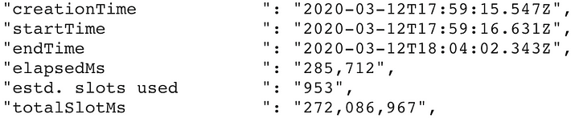

# BigQuery Slots
Resources and thoughts on estimating and determining best amount of slots needed for a certain Reservation.


Content
- [What is Reservation](#what-is-reservation)
- [What is Commitment](#what-is-commitment)
- [How to Estimate Slots](#how-to-estimate-slots)
- [Snippets](#snippets)


### What is Reservation

### What is Commitment

### How to Estimate Slots
It's possible to estimate[^1][^2] slot utilization metric using:

```math
us = \frac{ts}{e}
```
where:
- us: used slots
- ts: `totalSlotsMs` BigQuery metric
- e: `elapsedMs` Bigquery Metric

To know the average utilization over a period, use the base period in miliseconds[^3].

#### Example:


Image extracted from BigQuery from [^2].

The average over 1 hour where there will be only the execution of the images job, we will have the following:
```math
us = \frac{272086967}{60 * 60 * 1000} = 75.57
```
So, in average, we'll have 75 slots used on that hour. 
But this metric isn't that efficient to determine how many slots we wanna have available on our org. 
I mean, we can see that there is a peak and that this job will, at least, be delayed if we only have 75 slots available.
We are using 75 slots in average per hour, and 4.534 per second until this execution hits the end. When BigQuery
needs more slots to finish its job and there is no more available, the job starts to pile up until some slot make 
itself available to the engine.

But, unfortunately, if we are comming from an `on demand` or `non-editions offers`[^4]  BigQuery usage it's a little hard to determine upfront
what would be the best setup for our slots. In this case, the best would be to see the average (as we already seen before)
and peaks and valleys, in order to try to understand the profile.

After we have som info on executions, we can go for a more sofisticated metric. 
One of this metrics tell us about how many time a query stage waited for slot availability to continue its execution.
I'm talking about `avg_wait_ms`, as mentioned by [^2]. This metric only work if we have some sort of upper limitation
on the number of slots available to the org.


### Snippets
```sql
-- extract slot utilisation
-- Copyright 2022 Google LLC.
-- SPDX-License-Identifier: Apache-2.0

SELECT 
      FORMAT_TIMESTAMP("%F %H", period_start , "Australia/Sydney") as start_hour,
      sum(period_slot_ms)/3600000 as average_slots  -- deivide by 3,600,000  milliseconds
FROM  `region-US.INFORMATION_SCHEMA.JOBS_TIMELINE`   
WHERE 
    job_start_time > timestamp_sub(current_timestamp(), INTERVAL 7 day)
    AND job_type = "QUERY"
group by 1
```

```sql
-- extract Stage wait times for major stages
-- Copyright 2022 Google LLC.
-- SPDX-License-Identifier: Apache-2.0

WITH stages as (
 SELECT job_id, start_time as job_start,job_type, stage
 FROM  `region-US.INFORMATION_SCHEMA.JOBS`
 CROSS JOIN unnest(job_stages) as stage
 WHERE job_type = "QUERY"
 AND  total_slot_ms > 1e7  -- filter out minor stages
 ),
timings as (
 SELECT job_id, job_start,
    FORMAT_TIMESTAMP("%F %H", timestamp_millis(stage.start_ms) , "America/Sao_Paulo") as stage_start_hour,
    stage.wait_Ms_Avg
 FROM  stages
 WHERE stage.slot_ms > 1e8
)
SELECT stage_start_hour,
     FORMAT_TIMESTAMP("%H:%M:%S", timestamp_millis(cast(avg(wait_Ms_Avg) as Int)))    
                  as wait_avg,
FROM timings  
WHERE
    job_start > timestamp_sub(current_timestamp(), INTERVAL 7 day)
GROUP BY 1
ORDER BY 1
```

# References
[^1]: https://cloud.google.com/bigquery/docs/information-schema-jobs?hl=pt-br#calculate_average_slot_utilization
[^2]: https://medium.com/google-cloud/bigquery-slot-squeezes-896d9e0f2fc
[^3]: https://stackoverflow.com/questions/72187568/big-query-slot-estimator
[^4]: https://cloud.google.com/bigquery/docs/editions-intro#editions_features
